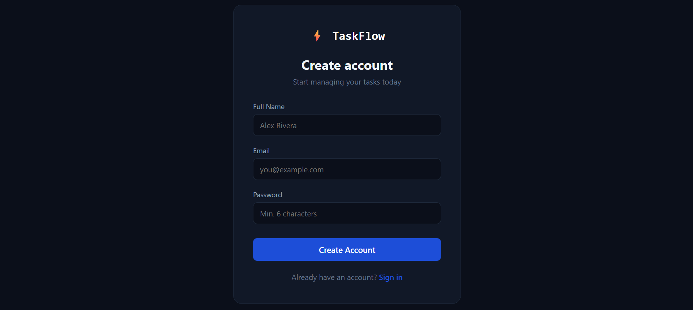
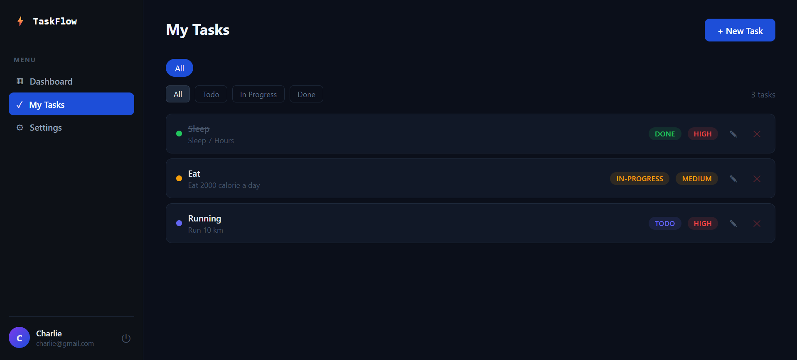
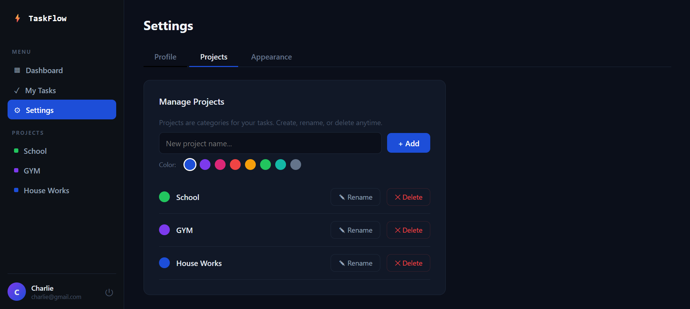

# ⚡ TaskFlow — Task Management System

A full-stack personal task management web application built with the MERN stack. TaskFlow allows users to register, log in, create custom projects, and manage tasks with priority and status tracking — all behind secure JWT authentication.


---

## 🚀 Features

- 🔐 **User Authentication** — Register, login, logout with JWT tokens and bcrypt password hashing
- 📋 **Task Management** — Create, edit, delete, and filter tasks by status and priority
- 📁 **Dynamic Projects** — Create custom color-coded project categories, rename or delete anytime
- 📊 **Dashboard** — Personalized stats with task completion overview and recent activity
- ⚙️ **Profile Settings** — Update name, email, password, and app appearance
- 🔄 **Status Cycling** — Click to cycle tasks through To Do → In Progress → Done
- 🎨 **App Customization** — Rename the app title (updates sidebar and browser tab)
- 📱 **Responsive UI** — Clean dark-themed interface that works across screen sizes

---

## 🛠️ Tech Stack

| Layer | Technology |
|---|---|
| Frontend | React.js 18, Vite, React Router DOM |
| Backend | Node.js, Express.js |
| Database | MongoDB, Mongoose |
| Auth | JWT (jsonwebtoken), bcryptjs |
| HTTP Client | Axios |
| Notifications | react-hot-toast |

---

## 📁 Project Structure

```
taskflow/
├── server/                  # Node.js + Express Backend
│   ├── config/
│   │   └── db.js            # MongoDB connection
│   ├── controllers/
│   │   ├── authController.js
│   │   ├── taskController.js
│   │   └── projectController.js
│   ├── middleware/
│   │   └── authMiddleware.js # JWT protection
│   ├── models/
│   │   ├── User.js
│   │   ├── Task.js
│   │   └── Project.js
│   ├── routes/
│   │   ├── authRoutes.js
│   │   ├── taskRoutes.js
│   │   └── projectRoutes.js
│   ├── .env                 # Environment variables (not pushed)
│   └── server.js
│
└── client/                  # React Frontend (Vite)
    └── src/
        ├── api/
        │   └── axios.js     # Axios instance + API functions
        ├── context/
        │   └── AuthContext.jsx
        ├── components/
        │   ├── PrivateRoute.jsx
        │   └── TaskModal.jsx
        └── pages/
            ├── Login.jsx
            ├── Register.jsx
            ├── Dashboard.jsx
            └── Settings.jsx
```

---

## 📡 API Endpoints

| Method | Endpoint | Description | Auth |
|---|---|---|---|
| POST | `/api/auth/register` | Register a new user | ❌ |
| POST | `/api/auth/login` | Login and get JWT token | ❌ |
| GET | `/api/auth/me` | Get current user | ✅ |
| PUT | `/api/auth/profile` | Update profile / password | ✅ |
| GET | `/api/tasks` | Get all user tasks | ✅ |
| POST | `/api/tasks` | Create a task | ✅ |
| PUT | `/api/tasks/:id` | Update a task | ✅ |
| DELETE | `/api/tasks/:id` | Delete a task | ✅ |
| GET | `/api/projects` | Get all user projects | ✅ |
| POST | `/api/projects` | Create a project | ✅ |
| PUT | `/api/projects/:id` | Update a project | ✅ |
| DELETE | `/api/projects/:id` | Delete a project | ✅ |

---

## ⚙️ Getting Started

### Prerequisites

- Node.js v18+
- MongoDB (local) or MongoDB Atlas account
- npm

### 1. Clone the repository

```bash
git clone https://github.com/abubakkersiddiqq/taskflow.git
cd taskflow
```

### 2. Setup the Backend

```bash
cd server
npm install
```

Create a `.env` file inside `server/`:

```env
PORT=5000
MONGO_URI=mongodb://localhost:27017/taskmanagement
JWT_SECRET=your_super_secret_key_here
JWT_EXPIRE=7d
```

Start the backend:

```bash
npm run dev
```

Server runs on `http://localhost:5000`

### 3. Setup the Frontend

```bash
cd ../client
npm install
npm run dev
```

Frontend runs on `http://localhost:5173`

---

## 🔐 Environment Variables

| Variable | Description |
|---|---|
| `PORT` | Backend server port (default: 5000) |
| `MONGO_URI` | MongoDB connection string |
| `JWT_SECRET` | Secret key for signing JWT tokens |
| `JWT_EXPIRE` | Token expiry duration (e.g. `7d`) |

> ⚠️ Never commit your `.env` file. It is already added to `.gitignore`.

---

## 📸 Screenshots

| Login | Dashboard |
|---|---|
|  |  |

| Task View | Create Project |
|---|---|
|  |  |

---

## 🗺️ Future Enhancements

- [ ] Team collaboration and shared projects
- [ ] Drag-and-drop Kanban board view
- [ ] Due date reminders and email notifications
- [ ] File attachments on tasks
- [ ] Admin panel for user management
- [ ] Cloud deployment (Render + Vercel)

---

## 👤 Author

**[Your Name]**
- GitHub: [@abubakkersiddiqq](https://github.com/abubakkersiddiqq)
- LinkedIn: [Abubakker Siddiq](https://linkedin.com/in/abubakker-siddiq-715759231/)

---

## 📄 License

This project is licensed under the MIT License.
